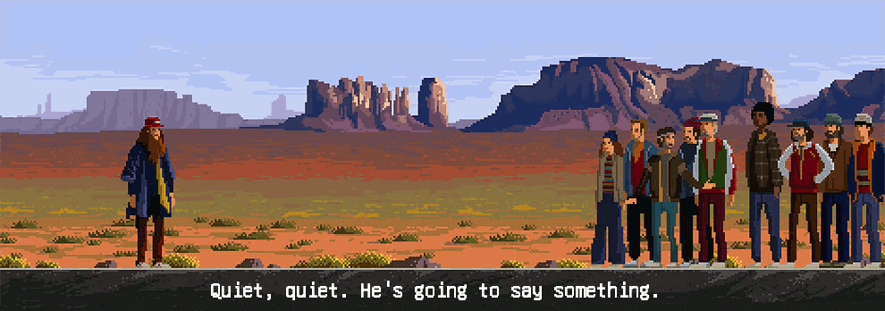

# I am Doruk Dorkodu

## About

- **Vefa'151**

- **Founder and Chief @ [Dorkodu](https://github.com/dorkodu)**

- **Self-taught Software Engineer**

- **Freewheelr, Thinker, Protagonist, High School Kid, Design and Experience Enthusiast**

**Web :** [Dorkodu - dorkodu.com](https://dorkodu.com) **Email :** [doruk@dorkodu.com](mailto:doruk@dorkodu.com) **Twitter :** [@dorkodu](https://twitter.com/dorkodu)

## What I have been doing in Software Engineering?

- **Wanderlyf** : the social knowledge network
- **Outsights** : a simple, minimalistic and intuitive PHP web framework
- **QuoteRL** : a new approach to data retrieval and API design 
- **Lucid Approach** : yet another simple approach on building awesome UX apps
- **Lucid** : a simple and lightweight JavaScript library for developing component-based UI web apps
- **Luckt** : a global state management library & pattern for Lucid apps
- **Lumberjack** : a JavaScript library for efficient data retrieval using QuoteRL
- **Loom** : a minimalistic dependency utility for PHP
- **Hindsight** : a utility that makes it simple to develop and maintain a Markdown based static website.

## What languages do I write?

- **C**, **PHP**, **JavaScript**, **HTML** + **CSS**

## Life Purpose

I want to change the world and human race's destiny. Literally.  I want to give people something they can live up to, a better life opportunity for everyone.  I want to do this by creating new products for humanity, inventing something new, real, useful, meaningful.  I will NOT do that for the sake of being rich. But why not to have power in the right hands?  I am working to push the limits of human civilization forward and give everyone a better life

## Life Goals - simplified

### Universal Knowledge Resource -- most important one

- Create a "social knowledge network" to understand how people express, create, exchange  and perceive knowledge. It will be like a virtual - artificial experimentation medium.
- Create a universal "standard" or "protocol" on what knowledge is, and how we exchange/acquire it. 
- Create "Universal Knowledge Resource" using that protocol
- Create a "Knowledge Search Engine" to give people a way to get pure information from that resource
- Create a "P2P Knowledge Exchange Protocol"
- Create the Internet of Brains, in which a person or an AI can connect and exchange information fast, efficiently, securely using that protocol.
- Create a way to imitate the process of teaching/learning something with just a data transfer process.  So people can truly exchange knowledge. After that, humanity can understand the important thing is not storing information in our brains. What makes us different is how we use it.
- Well Done.

### Others

- Clean and Drinkable Water Purification and Production Way
- Better, Renewable, Green, Free Energy Resource
- An Automated and Cheaper Way to Natural, More Productive, Efficient Agriculture
- A Way to Cheaper Space Mining, Travel and Exploration
- A Way to Manipulate Genetics like

## I am Inspired From

- **The Leader** : **Mustafa Kemal Atatürk** and the Turkish Independence Movement
- **Inspirers :** Steve Jobs, Elon Musk, Martin Luther King, Muhammad Ali, Linus Torvalds, Chris Gardner, Keanu Reeves, Richard Branson and more.
- **Cult Movies :** Forrest Gump, Pursuit of Happiness, The Matrix, Shawshank Redemption, The Godfather, The Green Mile, October Sky, The Prestige, The Man Who Knew the Infinity.

#### Music

- **Anatolian Rock, Folk Rock, Blues Rock, Psychedelic Genre, Soft Rock, Turkish Folk**
- Especially : **Bob Dylan, Jimi Hendrix, Led Zeppelin, The Beatles, Cem Karaca,  Erkin Koray, Imagine Dragons, Nirvana, Queen, Toad the Wet Sprocket**

#### Books

- Hitchhikers Guide to the Galaxy
- The Alchemist
- 1984
- Five Equalities That Changed The World
- You Don't Have To Born Brilliant
- The Little Prince
- Kürk Mantolu Madonna

## What languages do I speak?

- **Turkish**
- **American English**
- **German** (just a little)
