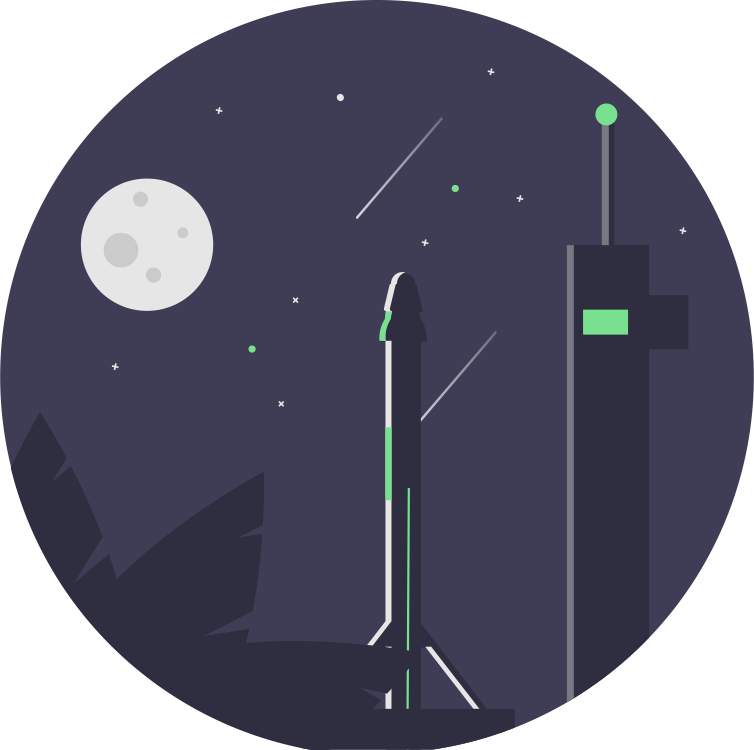

# I am Doruk Dorkodu

## About

- **Vefa'151**

- **Founder and Chief of Dorkodu - @dorkodu**

- **Self-taught Software Engineer**

- **Freewheeling, Thinker, Protagonist, High School Kid, Design and Experience Geek**

**Web :** [Dorkodu - dorkodu.com](https://dorkodu.com) **Email :** [doruk@dorkodu.com](mailto:doruk@dorkodu.com) **Twitter :** [@dorkodu](https://twitter.com/dorkodu)

## Life Purpose

I want to change the world and human race's destiny. Literally.  I want to give people something they can live up to, a better life opportunity for everyone.  I want to do this by creating new products for humanity, inventing something new, real, useful, meaningful.  I will NOT do that for the sake of capitalism.  But to push the limits of human civilization forward and give everyone a better and life

## Life Goals - simplified

### Universal Knowledge Resource

- Create a "social knowledge network" to understand how people express, create, exchange and perceive knowledge. It will be like a virtual - artificial experimentation medium.
- Create a universal "standard" or "protocol" on what knowledge is, and how we exchange/acquire it. 
- Create "Universal Knowledge Resource" using that protocol
- Create a "Knowledge Search Engine" to give people a way to get pure information from that resource
- Create a "P2P Knowledge Exchange Protocol"
- Create Internet of Brains, in which people or machines can connect and exchange information using that protocol

#### Clean and Drinkable Water Purification and Production Way

#### Better, Renewable, Green, Free Energy Resource

#### An Automated and Cheaper Way to Natural, More Productive, Efficient Agriculture

#### A Way to Cheaper Space Mining and Exploration

## What I have been doing in Software Engineering?

- **Wanderlyf** : the social knowledge network
- **Outsights** : a simple, minimalistic and intuitive PHP web framework
- **QuoteRL** : a new approach to data retrieval and API design 
- **Lucid Approach** : yet another simplest approach to building awesome UX apps
- **Lucid** : a simple and lightweight JavaScript library for developing component-based web apps
- **Luckt** : a public state management library & pattern for Lucid apps
- **Lumberjack** : a JavaScript library for efficient data retrieval using QuoteRL
- **Loom** : a minimalistic dependency utility for PHP
- **Hindsight** : a utility that makes it simple to develop, maintain and deploy a Markdown based site.

## What languages do I write?

- **C**, **PHP**, **JavaScript**, **HTML** + **CSS**

## Inspired From

- **The Leader** : **Mustafa Kemal Atatürk** and Turkish Independence Movement
- **Entrepreneurs :** **Steve Jobs, Elon Musk, Richard Branson, Chris Gardner**
- **Activists :** Martin Luther King, Muhammed Ali, Linus Torvalds, Richard Stallman
- **Cult Movies :** Forrest Gump, Pursuit of Happiness, Shawsank Redemption, The Godfather, The Matrix, The Green Mile

#### Music

- **Anatolian Rock, Folk Rock, Blues Rock, Psychedelic Rock, Soft Rock**
- Especially : **Bob Dylan, Jimi Hendrix, Led Zeppelin, The Beatles, Cem Karaca,  Erkin Koray, Imagine Dragons, Nirvana, Queen, Toad the Wet Sprocket**

#### Books

- Hitchhikers Guide to the Galaxy
- The Alchemist
- 1984
- Five Equalities That Changed The World
- You Don't Have To Born Brilliant
- The Little Prince
- Kürk Mantolu Madonna
- Nutuk

## What languages do I speak?

- **Turkish**
- **American English**
- **German** (just a little)
